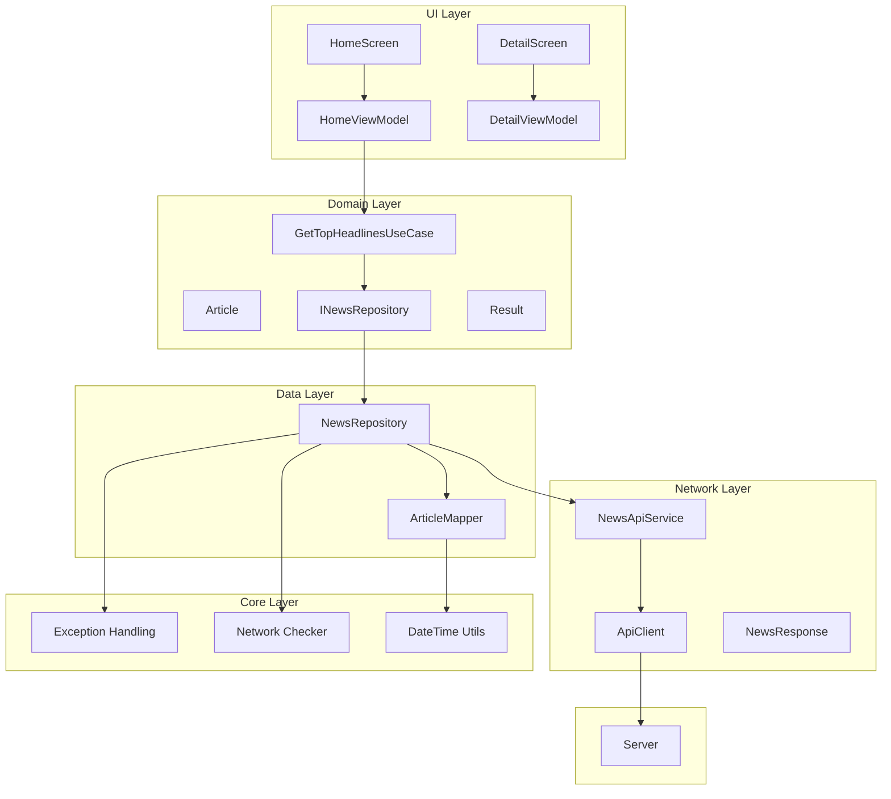
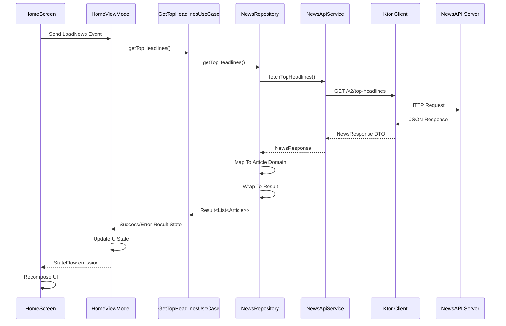
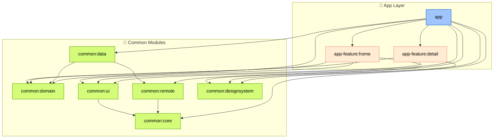

# 📰 Newsly - Android News Application

Une application mobile Android pour consulter les dernières actualités internationales, construite avec Clean Architecture, Jetpack Compose, et les dernières technologies Android (MAD).

## 🚀 Stack Technique

- **UI:** Jetpack Compose + Material 3
- **Architecture:** Clean Architecture + MVVM
- **DI:** Koin 4.1.0
- **Network:** Ktor Client 3.2.3
- **Navigation:** Navigation 3 (Alpha)
- **Build:** Convention Plugins + Version Catalog

## ✨ Fonctionnalités

### ✅ Implémentées
- Liste des dernières actualités avec images et métadonnées.
- Vue détaillée des articles
- Consultez l'article complet sur le site officiel.
- Pull-to-refresh.
- Gestion des erreurs.
- Structure évolutive.

### 🚧 À implémenter
- Cache local (Room) (pas encore fait pour évite la complexité pour ce test)
- Fonctionnalité de recherche
- Favoris
- Catégories
- Partage d'articles
- Choix de la langue
- WorkManager pour sync en arrière-plan
- Paging 3 pour chargement infini
- Paramétrage de l'application (DataStore pour préférences utilisateur)
- Tests avec coverage minimale 80%


## 🛠️ Installation

1. **Obtenir une clé NewsAPI** depuis [newsapi.org](https://newsapi.org)

2. **Configurer la clé API**
- Ajouter dans `local.properties` :
  ```properties

  API_KEY=votre_cle_newsapi_ici


##  📐 Vue d'ensemble de l'Architecture




### 🔄 Flux de Données (Exemple de chargement et affichage de l'actualité)



### 📂 Architecture Modulaire

🎯 Principe de Séparation

Le projet Newsly suit une **architecture modulaire multi-modules** inspirée du **Clean Architecture**.




| Couche             | Modules                                                                                      | Rôle principal |
|--------------------|----------------------------------------------------------------------------------------------|----------------|
| **Présentation**   | `app`, `app-feature:home`, `app-feature:detail`, `common:ui`, `common:designsystem`          | Affichage UI, interaction avec l’utilisateur, logique d’écran |
| **Domaine**        | `common:domain`                                                                              | Cas d’usage, logique métier pure, indépendance des frameworks |
| **Données**        | `common:data`, `common:remote`                                                               | Gestion des sources de données (API, base locale, etc.) |
| **Infrastructure** | `common:core`                                                                                | Outils, helpers|


- **Modulaire** : Chaque fonctionnalité est isolée dans son propre module (`app-feature:*`).
- **Réutilisable** : Les modules `common:*` peuvent être utilisés par plusieurs features ou directement par l’app.
- **Facile à maintenir** : Une modification dans un module impacte peu les autres.


## Choix Techniques :

#### Pourquoi Clean Architecture ?


"La Clean Architecture offre une structure modulaire et évolutive, séparant les responsabilités pour faciliter la maintenance et l’évolution."
Références :  [https://developer.android.com/topic/architecture?hl=fr](https://blog.alphorm.com/avantages-clean-architecture-android)

##### Couche domaine (Le Domain au centre)

App-feature(ui) → Domain ← Data
###### Dans l'implémentation de l'app Newsly, la couche domain ne dépend d'aucune autre couche.
   + **Isolation métier** - Logique métier indépendanet et isolée.
   + **Testabilité** - Domain sans dépendances externes.
   + **Réutilisabilité** - Logique métier portable entre plateformes.
   + Changement dans la couche data = **pas d'impact sur le métier**.


##### Architecture modulaire 
Structure multi-modules avec séparation par fonctionnalité et par couche.
+ Compilation incrémentale, builds parallèles.
+ La possibilité que chaque équipe peut travailler indépendamment sur un module.
+ Moins de conflits Git.
+ Visibilité contrôlée.
+ Responsabilité unique.

##### Pourquoi Koin ? 

```Koin 4.1.0 pour l'injection de dépendances.```
+ **Simplicité** : Configuration plus simple, moins de boilerplate et pas d'annotations complexes.
+ **Kotlin-first** : juste du Kotlin DSL (ex : module { single { ... } })
+ **Pas de génération de code à la compilation** : tout se fait à l’exécution (runtime) donc pas de compilation longue à cause de la génération de code.
+ Dans un projet multi-modules (app, app-feature:*, common:*), Koin permet d’avoir des modules DI **indépendants facilement injectables**.
+ **Courbe de démarrage**

> Le choix dans ce projet est basé sur : rapidité, flexibilité et simplicité.

> Cela dit, je suis pas totalement opposé à l’utilisation de **Hilt** : il reste un excellent choix, notamment pour sa vérification à la compilation et son intégration officielle dans l’écosystème Android).

##### Pourquoi Ktor ?
```Ktor Client 3.2.3 pour interagir avec l'API [newsapi.org](https://newsapi.org)```
+ **Coroutines natives** : Intégration parfaite avec les coroutines.
+ **Natif Kotlin**
+ **Multiplatform par défaut** (Une éventuel possibilité de partager le module remote pour un projet KMM).
+ **Sans annotations** : tout est défini en code Kotlin pur et moins de génération de code.
+ **Support natif de la sérialisation JSON** (`kotlinx.serialization`).
+ **Stack 100% Kotlin**, pas de Java.
> Ktor a été choisi ici pour sa **flexibilité** et sa **portabilité**.

##### Pourquoi Navigation 3 en version Alpha ?
```Convention plugins personnalisés dans build-logic.```

Le but prochain est de faire de l'app Newsly une application compatible pour tout type d'écran, comme par exemple un écran large, Newsly est censée se comporter d'une maniere plus fluide : 

--------


[ HomeScreen | DetailScreen ] pour les écrans larges

[ HomeScreen ] → [ DetailScreen ] pour les petits écrans

Réf : https://android-developers.googleblog.com/2025/05/announcing-jetpack-navigation-3-for-compose.html

--------

+ **Layouts adaptatifs** : nouvelle API `Scenes` permettant de gérer facilement les affichages mono-pane et multi-pane (idéal pour tablettes ou écrans larges). (À integrer dans le projet dans une prochaine évolution)
+ **Support amélioré du multi-backstack** : gestion plus simple de plusieurs graphes de navigation en parallèle.
- **Dans Navigation 2** (NavController classique), la navigation est une “boîte noire” : on envoie que des commandes (navigate(), popBackStack()) et la librairie stocke l’état quelque part, inaccessible directement.
+ **Dans Navigation 3**, le back stack est juste une liste qu'on définis et qu'on peut facielement contrôlé.
+ **Debug plus simple** : peux afficher le contenu du back stack à tout moment.
- **Risque** : Version alpha, API peut changer.

Avec Nav2 (ancienne version) : 

  ```
navController.navigate("detail/article1")
  ```


Avec Nav3 (own the back stack) :

````
val backStack = rememberNavBackStack<NavKey>(Home)
backStack.add(Detail("article1"))
backStack.removeLastOrNull() // revenir en arr
````

##### Pourquoi Convention Plugins ?
```Convention plugins personnalisés dans build-logic.```
+   **Configuration centralisée ** : pas de duplication.
+   **Cohérence ** : Même configuration pour tous les modules


🏢  Developped by Abdo

