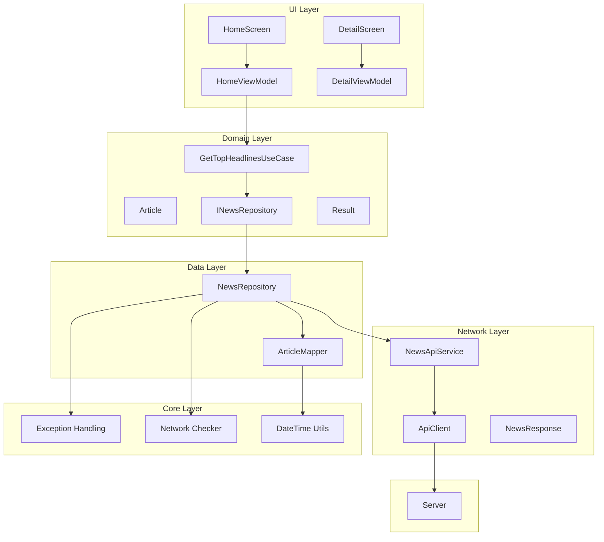
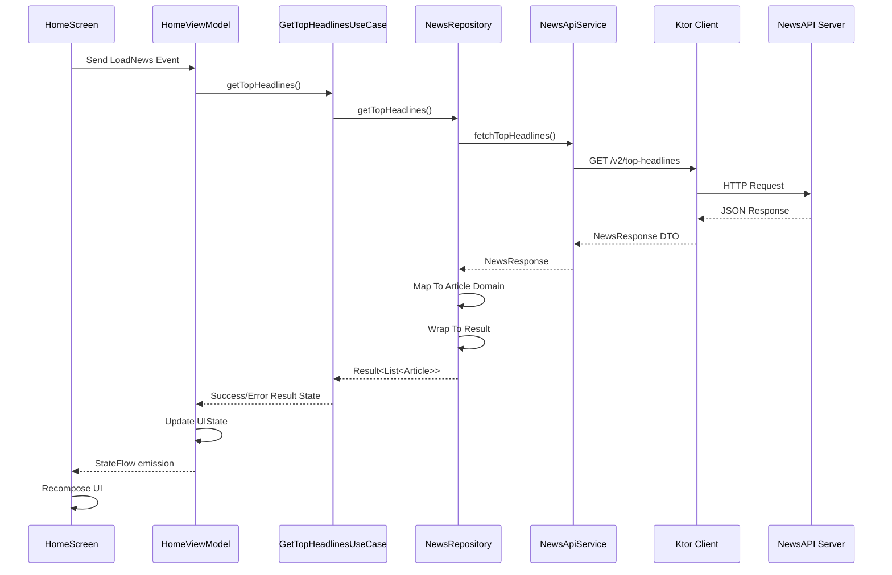
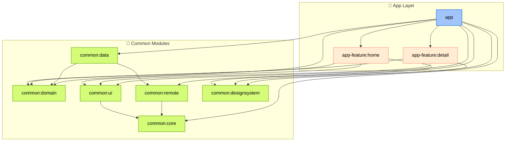

# 📰 Newsly - Android News Application

Une application mobile Android pour consulter les dernières actualités internationales, construite avec Clean Architecture, Jetpack Compose, et les dernières technologies Android (MAD).

## 🚀 Stack Technique

- **UI:** Jetpack Compose + Material 3
- **Architecture:** Clean Architecture + MVVM
- **DI:** Koin 4.1.0
- **Network:** Ktor Client 3.2.3
- **Navigation:** Navigation 3 (Alpha)
- **Build:** Convention Plugins + Version Catalog

## ✨ Fonctionnalités

### ✅ Implémentées
- Liste des dernières actualités avec images et métadonnées.
- Vue détaillée des articles
- Consultez l'article complet sur le site officiel.
- Pull-to-refresh.
- Gestion des erreurs.

### 🚧 À implémenter
- Cache local (Room)
- Fonctionnalité de recherche
- Favoris
- Catégories
- Partage d'articles
- Choix de la langue

## 🛠️ Installation

1. **Obtenir une clé NewsAPI** depuis [newsapi.org](https://newsapi.org)

2. **Configurer la clé API**
- Ajouter dans `local.properties` :
  ```properties

  API_KEY=votre_cle_newsapi_ici


##  📐 Vue d'ensemble de l'Architecture




### 🔄 Flux de Données (Exemple de chargement et affichage de l'actualité)



### 📂 Architecture Modulaire

🎯 Principe de Séparation

Le projet Newsly suit une **architecture modulaire multi-modules** inspirée du **Clean Architecture**.




| Couche             | Modules                                                                                      | Rôle principal |
|--------------------|----------------------------------------------------------------------------------------------|----------------|
| **Présentation**   | `app`, `app-feature:home`, `app-feature:detail`, `common:ui`, `common:designsystem`          | Affichage UI, interaction avec l’utilisateur, logique d’écran |
| **Domaine**        | `common:domain`                                                                              | Cas d’usage, logique métier pure, indépendance des frameworks |
| **Données**        | `common:data`, `common:remote`                                                               | Gestion des sources de données (API, base locale, etc.) |
| **Infrastructure** | `common:core`                                                                                | Outils, helpers|


- **Modulaire** : Chaque fonctionnalité est isolée dans son propre module (`app-feature:*`).
- **Réutilisable** : Les modules `common:*` peuvent être utilisés par plusieurs features ou directement par l’app.
- **Facile à maintenir** : Une modification dans un module impacte peu les autres.


🛠️ Stack Technique Détaillé :
Clean Architecture Implementation


🏢  Developped by Abdo

