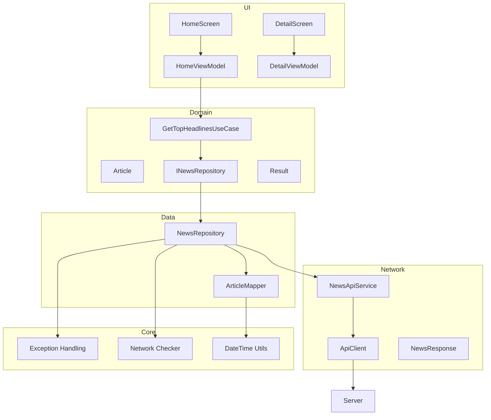
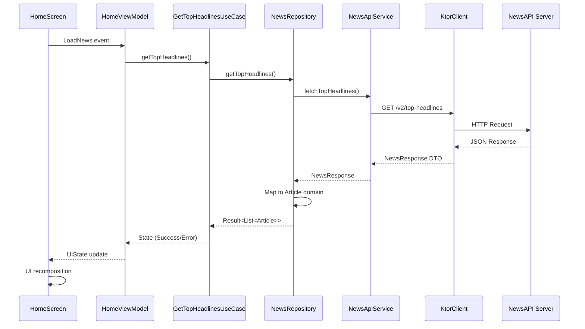
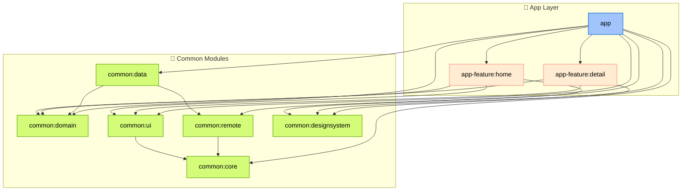

# 📰 Newsly – Android News Application

**Newsly** est une application Android moderne pour consulter les dernières actualités internationales, construite avec **Clean Architecture**, **Jetpack Compose**, et les dernières technologies Android (MAD).

---

## 🚀 Stack Technique

| Composant | Technologies |
|-----------|-------------|
| **UI** | Jetpack Compose + Material 3 |
| **Architecture** | Clean Architecture + MVVM |
| **DI** | Koin 4.1.0 |
| **Network** | Ktor Client 3.2.3 |
| **Navigation** | Navigation 3 (Alpha) |
| **Build** | Convention Plugins + Version Catalog |

---

## ✨ Fonctionnalités

### ✅ Implémentées
- Liste des dernières actualités avec images et métadonnées
- Vue détaillée des articles
- Consultation de l'article complet sur le site officiel
- Pull-to-refresh
- Gestion des erreurs
- Structure évolutive et maintenable

### 🚧 À venir
- Cache local avec Room
- Favoris
- Partage d'articles
- Choix de la langue
- Synchronisation en arrière-plan avec WorkManager
- Pagination infinie avec Paging 3
- Paramétrage utilisateur (DataStore)
- Tests avec couverture minimale de 80%

---

## 🛠️ Installation

1. Obtenez une clé API depuis [newsapi.org](https://newsapi.org)
2. Ajoutez-la dans `local.properties` à la racine du projet :
   ```properties
   API_KEY=votre_cle_newsapi_ici
   ```

---

## 📐 Vue d'ensemble de l'Architecture

### Diagramme d'Architecture Générale



### 🔄 Flux de Données (Exemple de chargement et affichage de l'actualité)



### 📂 Architecture Modulaire

🎯 **Principe de Séparation**

Le projet Newsly suit une **architecture modulaire multi-modules** inspirée du **Clean Architecture**.



### Répartition par Couches

| Couche | Modules | Rôle principal |
|--------|---------|----------------|
| **Présentation** | `app`, `app-feature:home`, `app-feature:detail`, `common:ui`, `common:designsystem` | Affichage UI, interaction avec l'utilisateur, logique d'écran |
| **Domaine** | `common:domain` | Cas d'usage, logique métier pure, indépendance des frameworks |
| **Données** | `common:data`, `common:remote` | Gestion des sources de données (API, base locale, etc.) |
| **Infrastructure** | `common:core` | Outils, helpers |

**Avantages :**
- **Modulaire** : Chaque fonctionnalité est isolée dans son propre module (`app-feature:*`)
- **Réutilisable** : Les modules `common:*` peuvent être utilisés par plusieurs features ou directement par l'app
- **Facile à maintenir** : Une modification dans un module impacte peu les autres

---

## 🏗️ Choix Techniques

### Pourquoi Clean Architecture ?

"La Clean Architecture offre une structure modulaire et évolutive, séparant les responsabilités pour faciliter la maintenance et l'évolution."

**Références :** [Android Architecture Guide](https://developer.android.com/topic/architecture?hl=fr)

#### Couche domaine (Le Domain au centre)

```
App-feature(ui) → Domain ← Data
Dans l'implémentation de l'app Newsly, la couche domain ne dépend d'aucune autre couche.
```

**Avantages :**
+ **Isolation métier** - Logique métier indépendante et isolée
+ **Testabilité** - Domain sans dépendances externes
+ **Réutilisabilité** - Logique métier portable entre plateformes
+ Changement dans la couche data = **pas d'impact sur le métier**

#### Architecture modulaire 

Structure multi-modules avec séparation par fonctionnalité et par couche.

**Bénéfices :**
+ Compilation incrémentale, builds parallèles
+ La possibilité que chaque équipe peut travailler indépendamment sur un module
+ Moins de conflits Git
+ Visibilité contrôlée
+ Responsabilité unique

### Pourquoi Koin ?

**Koin 4.1.0 pour l'injection de dépendances**

**Avantages :**
+ **Simplicité** : Configuration plus simple, moins de boilerplate et pas d'annotations complexes
+ **Kotlin-first** : juste du Kotlin DSL (ex : `module { single { ... } }`)
+ **Pas de génération de code à la compilation** : tout se fait à l'exécution (runtime) donc pas de compilation longue à cause de la génération de code
+ Dans un projet multi-modules (app, app-feature:*, common:*), Koin permet d'avoir des modules DI **indépendants facilement injectables**
+ **Courbe de démarrage**

> Le choix dans ce projet est basé sur : rapidité, flexibilité et simplicité.
> 
> Cela dit, je ne suis pas totalement opposé à l'utilisation de **Hilt** : il reste un excellent choix, notamment pour sa vérification à la compilation et son intégration officielle dans l'écosystème Android.

### Pourquoi Ktor ?

**Ktor Client 3.2.3 pour interagir avec l'API [newsapi.org](https://newsapi.org)**

**Avantages :**
+ **Coroutines natives** : Intégration parfaite avec les coroutines
+ **Natif Kotlin**
+ **Multiplatform par défaut** (Une éventuelle possibilité de partager le module remote pour un projet KMM)
+ **Sans annotations** : tout est défini en code Kotlin pur et moins de génération de code
+ **Support natif de la sérialisation JSON** (`kotlinx.serialization`)
+ **Stack 100% Kotlin**, pas de Java

> Ktor a été choisi ici pour sa **flexibilité** et sa **portabilité**.

### Pourquoi Navigation 3 en version Alpha ?

Le but prochain est de faire de l'app Newsly une application compatible pour tout type d'écran, comme par exemple un écran large, Newsly est censée se comporter d'une manière plus fluide :

**Vision :**
- `[ HomeScreen | DetailScreen ]` pour les écrans larges
- `[ HomeScreen ] → [ DetailScreen ]` pour les petits écrans

**Référence :** [Announcing Jetpack Navigation 3](https://android-developers.googleblog.com/2025/05/announcing-jetpack-navigation-3-for-compose.html)

**Avantages :**
+ **Layouts adaptatifs** : nouvelle API `Scenes` permettant de gérer facilement les affichages mono-pane et multi-pane (idéal pour tablettes ou écrans larges)
+ **Support amélioré du multi-backstack** : gestion plus simple de plusieurs graphes de navigation en parallèle
+ **Dans Navigation 2** (NavController classique), la navigation est une "boîte noire" : on envoie que des commandes (`navigate()`, `popBackStack()`) et la librairie stocke l'état quelque part, inaccessible directement
+ **Dans Navigation 3**, le back stack est juste une liste qu'on définit et qu'on peut facilement contrôler
+ **Debug plus simple** : peut afficher le contenu du back stack à tout moment

**Inconvénient :**
- **Risque** : Version alpha, API peut changer

**Comparaison :**

Avec Nav2 (ancienne version) :
```kotlin
navController.navigate("detail/article1")
```

Avec Nav3 (own the back stack) :
```kotlin
val backStack = rememberNavBackStack<NavKey>(Home)
backStack.add(Detail("article1"))
backStack.removeLastOrNull() // revenir en arrière
```

### Pourquoi Convention Plugins ?

**Convention plugins personnalisés dans build-logic**

**Avantages :**
+ **Configuration centralisée** : pas de duplication
+ **Cohérence** : Même configuration pour tous les modules

---

## 👨‍💻 Développé par

**Abdo** - Développeur Android

---

## 📄 Licence

Ce projet est sous licence MIT - voir le fichier [LICENSE](LICENSE) pour plus de détails.
